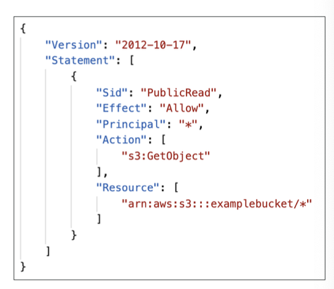

# 개요

- AWS에서 infinitely scaling storage 라고 광고하는 서비스이다.
- 많은 웹사이트들은 백본으로써 S3를 사용한다.
- 많은 AWS 서비스들은 S3와 통합이 용이하다.
## Buckets

- S3는 bucket 이라는 단위의 디렉토리에 객체(파일)들을 저장한다.
- bucket은 글로벌하게 고유한 이름을 가져야한다.(모든 지역 또는 모든 계정에 한하여 고유해야함)
- S3는 글로벌 서비스처럼 보이지만 bucket은 지역 레벨에서 생성되고 정의된다.

## Objects

- Objects는 Key를 가지고 있다.
- Key는 full path를 의미한다.
	- s3://my-bucket/my_file.txt
	- s3://my-bucket/my_folder1/another_folder/my_file.txt
- Key는 prefix + Object name 으로 구성되어있다.
	- s3://my-bucket/my_folder1/another_folder/my_file.txt 에서 prefix는 my_folder1/another_folder 이고 Object name은 my_file.txt 이다.
- S3 bucket에는 디렉토리(폴더)라는 개념이 존재하지 않는다. (UI적으로만 그렇게 존재하는 것이다)
- 오직 /로 나뉘어진 긴 Key값을 의미한다.

## Objects (cont.)

- Object 값들은 컨텐츠이다.
	- 최대 Object의 크기는 5TB이다.
	- 5GB가 넘는 컨텐츠를 업로드하면 반드시 multi-part upload를 사용해서 업로드해야 한다.
- Metadata
- Tags - 보안 또는 생명주기 관리에 유용하다.
- Version ID(버전관리)

## Security

- User Based
	- IAM Policies: 특정 API는 특정 유저만 호출이 가능하게 설정이 가능하다.
- Resource-Based
	- Bucket Policies: S3 콘솔에서의 버킷 규칙을 의미한다.
	- Object Access Control List(ACL)
	- Bucket Access Control List(ACL)
- Encryption: 암호화 키를 이용해서 S3내에 암호화된 Object를 넣는 것을 의미한다.

## Bucket Policies

- JSON based policies
	- Resources: 버킷 또는 객체를 의미 기입하면 된다.
	- Effect: Allow 또는 Deny중에 하나를 입력하면 된다. 허용할지 거부할지 결정하는 것이다.
	- Actions: 기입한 Resource에 대해서 어떤 액션을 허용 또는 거부할지 기입하면 된다.
	- Principal: 해당 정책을 적용할 계정 또는 사용자를 기입하면 된다. * 를 기입하면 모두가 해당된다.

- S3 bucket Policy는 다음과 같은 용도로 사용한다.
	- 버킷에 퍼블릭 액세스 권한을 필요로할 때
	- 객체를 반드시 암호화시켜서 업로드할 필요가 있을 때
	- 또 다른 계정이 액세스가 필요할 때
## Bucket settings for Block Public Access

- 이 설정은 회사의 데이터 유출을 막기 위함에 설정한다.
- 버킷이 절대 퍼블릭하게 액세스가 불가능하게 하려면 이 설정을 키는것을 추천한다.
- 계정 레벨로 세팅이 가능하다.

## Static Website Hosting

- S3는 인터넷에서 액세스가 가능한 정적 웹사이트 호스팅이 가능하다.
- 웹사이트 URL은 지역과 버킷명에 따라서 자동으로 생성된다.
	- http://bucket-name.s3-website-aws-region.amazonaws.com
	- http://bucket-name.s3-website.aws-region.amazonaws.com
- 만약 웹사이트 호스팅을 했는데 응답이 403이 온다면 버킷 정책에 퍼블릭 읽기 설정을 주면 된다.

## Versioning

- S3 버킷에 있는 객체에 버전관리가 가능하다.
- 버킷 레벨에서 활성화하면 된다.
- 같은 Object Key값을 업로드하면 덮어씌워지면서 버전 1, 2, 3 ... 으로 나아가게 된다.
- 의도치않게 삭제된 객체를 다시 되돌릴 수 있는 장점이 존재한다.
## Replication(CRR & SRR)

- 반드시 버전관리를 활성화 해야한다.
- 복제에는 다음과 같이 두 가지의 방법이 존재한다.
	- Cross-Region Replication(CRR)
	- Same-Region Replication(SRR)
- 비동기적으로 복제가 이루어진다.
- 반드시 S3에 적절한 IAM 권한을 부여해야한다.
- Replication을 활성화하면 그 때부터 새롭게 업로드된 객체부터 적용이 이루어진다.
	- 선택옵션으로는 기존의 S3 Objects까지 복제를 하고싶다면 S3 Batch Replication을 사용해야한다.
		- 이 옵션은 기존 객체와 복제에 실패한 객체까지 복제한다.
- 선택 옵션으로 삭제 마커가 있는 객체도 복제가 가능하다.
	- 버전 ID가 존재하는 삭제는 복제되지 않는다.
- 전파 복제는 존재하지 않는다.
	- 예를들어 버킷 1을 복제해서 버킷 2를 구성하고, 버킷 2를 복제해서 버킷 3을 구성해도 버킷 1에 대한 정보는 버킷 3에 복제되지 않는다.
## Storage Classes

- S3 Standard: 범용 목적
- S3 Standard-Infrequent Access(IA): 덜 자주 액세스하는 객체들을 저장하기 위한 목적
- S3 One Zone-Infrequent Access
- S3 Glacier Instant Retrieval
- S3 Glacier Flexible Retrieval
- S3 Glacier Deep Archive
- S3 Intelligent Tiering

스토리지 클래스간의 이동이 가능하다.

## S3 Durability and Availability

- Durability
	- 여러 AZ간의 높은 내구성
	- 만약 S3 버킷에 1000만개의 객체가 있다면, 평균적으로 매 10000년에 하나의 객체가 손실될 위험이 존재한다. 즉, 거의 손실될 일이 없다.
	- 모든 스토리지 클래스에 동일하게 적용된다.
- Availability
	- 높은 가용성을 보여준다.
	- 스토리지 클래스마다 가용성이 다르다.
	- 매년에 약 53분의 서비스가 사용불가할 정도로 가용성이 우수하다.

## S3 Standard - General Purpose

- 99.99%의 가용성
- 자주 액세스하는 데이터를 저장할 때 사용한다.
- 낮은 네트워크 지연시간과 높은 출력 성능
- 빅데이터 분석, 모바일 및 게이밍 앱, 콘텐츠 분산 등에 적합하다.
## S3 Infrequent Access(IA)

- 덜 자주 액세스하는 데이터를 저장하지만 액세스할 때에는 빠른 응답시간을 필요로하는 데이터를 저장할 떄 사용한다.
- S3 Standard 스토리지 클래스보다 저렴하다.
- Standard-Infrequent Access(S3 Standard-IA)
	- 99.9%의 가용성
	- 재난 복구, 백업에 적합하다.
- One Zone-Infrequent Access(S3 One Zone-IA)
	- 한 개의 AZ에서 고가용성(99.999999999%), 하지만 AZ가 파괴된다면 데이터가 손실된다.
	- 평균 99.5%의 가용성
	- 온프레미스 데이터의 2차 백업 용도 또는 재생성할 수 있는 데이터 저장 용도로 적합하다.
## S3 Glacier Storage Classes

- 데이터를 보관하거나 백업용도로 쓰이는 저렴한 Object 스토리지이다.
- 가격은 데이터 저장비용 + 데이터 검색 비용으로 측정된다.
- Glacier Instant Retrieval
	- ms의 검색 속도를 보여주며, 분기에 한 번 데이터 액세스를 하는 경우 적합하다.
	- 90일 정도의 최소 스토리지 저장 기간이 존재한다.
- Glacier Flexible Retrieval
	- Expedited(1 ~ 5분), Standard(3 ~ 5시간), Bulk(5 ~ 12시간)이 무료이다.
	- 90일 정도의 최소 스토리지 저장 기간이 존재한다.
- Glacier Deep Archive - long term storage
	- Standard(12시간), Bulk(48시간)이 무료이다.
	- 180일 정도의 최소 스토리지 저장 기간이 존재한다.
## S3 Intelligent-Tiering
- 사용량에 따라서 Object를 자동으로 Access Tier간의 이동시켜주는 설정이다.
- 복구 비용은 따로 들지 않는다.
- Frequent Access tier(automatic): 기본 티어
- Infrequent Access tier(automatic): 30일동안 액세스하지 않은 객체
- Archive Instant Access tier(automatic): 90일 동안 액세스하지 않은 객체
- Archive Access tier(optional): 90일 ~ 700일 동안 액세스하지 않은 객체
- Deep Archive Access tier(optional): 180 ~ 700일 동안 액세스하지 않은 객체
